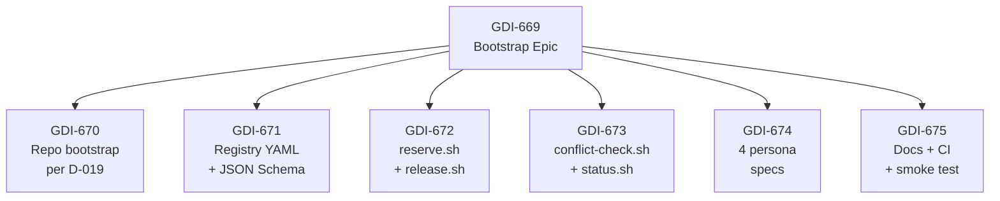
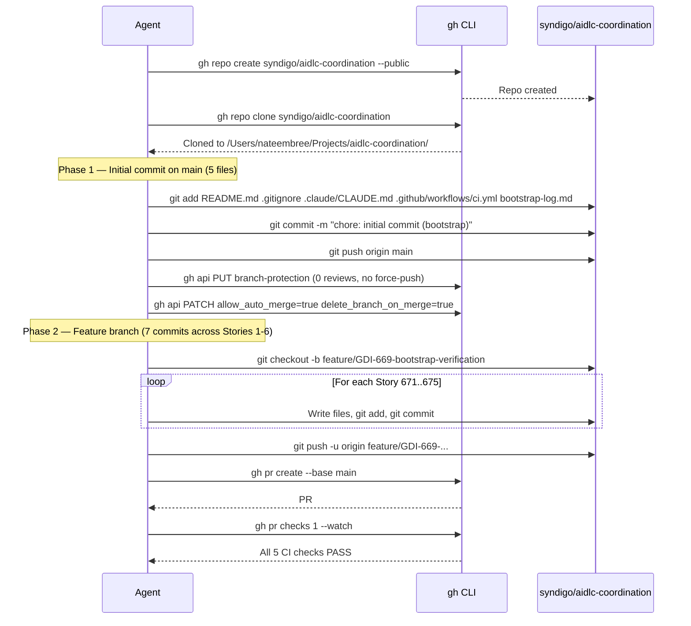

# AIDLC Working Session: GDI-669 — AIDLC Coordination Service bootstrap

**Date:** 2026-05-13
**Pipeline:** SDLC Orchestrator v1.0 (Claude Code)
**Profile:** generic (no profile yet for this product — follow-up epic to author one)
**Run Size:** S (strict, user-locked via `--size S`)
**Verdict:** **SHIPPED CLEAN** — 10 of 10 stages PASS (Stage 7 caught + remediated a `--json` defect in 1 commit before merge)
**Release:** [v0.1.0](https://github.com/syndigo/aidlc-coordination/releases/tag/v0.1.0) (merge SHA `b49f3c56f702400cebb1e534e56c7773e5f423f6`)
**Wall-clock:** ~1h 10min end-to-end

---

## Executive Summary

After 9 days of running parallel SDLC sessions against `syndigo/ugc-platform`, the user wanted to scale from ~2 ad-hoc parallel runs (with manual collision recovery) to 10 disciplined parallel sessions (one per spec section A–J). This run delivers the **foundation** for that goal: a new repo `syndigo/aidlc-coordination` containing a file-based allocation registry, three POSIX-bash coordination scripts, and four persona markdown specifications.

The key innovation is the *registry as state machine, git as audit trail* pattern. Every reservation, release, and conflict check produces a git commit in the coordination repo. No HTTP service, no AWS resources, no Terraform — just a YAML file, four shell scripts, and the existing git workflow that everyone already uses.

The day-1 smoke test passes live: open two shell sessions (simulating two Claude tabs), run `conflict-check.sh --section A --files-to-touch ModelRegistry.kt` and `conflict-check.sh --section C --files-to-touch ModelRegistry.kt` — Section A sees its own hold (GO, exit 0), Section C sees Section A's lock (WAIT, exit 1) with the holder, epic, and expiry timestamp.

The `/coordinate` skill, Compliance Reviewer webhook, Retro Aggregator scheduled job, and TFC deploy mailbox automation are **deferred to follow-up epics**. The personas describing them are documented in `personas/*.md`; the implementation is the next epic after `/sdlc --coordinate` integration into UGC Platform.

---

## What is AIDLC?

AIDLC = AI-Driven SDLC. The `/sdlc` skill orchestrates 11 specialized agentic teams across the full lifecycle of a software delivery: Initiation, Planning, Design, Development, Build, CI Pipeline, Test, Deploy, Release, Close, plus optional Maintenance. Plus the post-pipeline phases 12b (Session Doc), 12c (Learnings), 13 (Retrospective + Self-Improvement), and 14 (Post-Deploy Ops).

This pipeline is **self-improving** — each run's lessons learned feed into the platform profile, which feeds the next run. After 12 runs against UGC Platform, the `ugc-platform.yml` profile has 30+ codified known-issues and 5 explicit stage gates. The same loop applies here — the future `aidlc-coordination.yml` profile will accumulate lessons specific to this product.

```mermaid
flowchart LR
  P0[Phase 0<br/>Intake] --> P05[Phase 0.5<br/>Sizing]
  P05 --> P07[Phase 0.7<br/>Intent Validation]
  P07 --> S1[Stage 1<br/>Initiation]
  S1 --> S2[Stage 2<br/>Planning]
  S2 --> S3[Stage 3<br/>Design]
  S3 --> S4[Stage 4<br/>Development]
  S4 --> S5[Stage 5<br/>Build]
  S5 --> S6[Stage 6<br/>CI Pipeline]
  S6 --> S7[Stage 7<br/>Test]
  S7 --> S8[Stage 8<br/>Deploy]
  S8 --> S9[Stage 9<br/>Release]
  S9 --> S10[Stage 10<br/>Close]
  S10 --> P12b[Phase 12b<br/>Session Doc]
  P12b --> P12c[Phase 12c<br/>Learnings]
  P12c --> P13[Phase 13<br/>Retrospective]
  P13 --> P14[Phase 14<br/>Post-Deploy Ops]

  classDef skip fill:#eee,stroke:#999,color:#666
  class S2,S3,S6 skip
```



For an S-sized run, stages 2, 3, and 6 SKIP — the PR is the design record. All quality gates (ACs in Jira, tests, CI, deploy checks, close with evidence) still run.

---

## Pipeline Architecture (S-sized depth chart)

| Stage | Behavior | Verdict |
|---|---|---|
| 1. Initiation | Full (always runs) | PASS |
| 2. Planning | SKIP (S — PR is the decision record) | SKIP |
| 3. Design | SKIP (S — PR is the design record) | SKIP |
| 4. Development | Full | PASS (greenfield bootstrap per D-019) |
| 5. Build | Full | PASS (first-attempt green CI) |
| 6. CI Pipeline | SKIP (S — verify existing) | SKIP |
| 7. Test | Unit + AC verification | BLOCK→PASS (--json defect remediated) |
| 8. Deploy | Full | PASS (PR merged, scripts work from main) |
| 9. Release | Patch tag | PASS (v0.1.0 cut) |
| 10. Close | Jira update | PASS (epic + 6 stories Done) |

---

## Phase 0: Pre-Flight & Intake

- **Profile:** No profile yet for `aidlc-coordination` — generic mode. The future profile authoring is a follow-up epic.
- **Atlassian:** REST mode (env vars set: `ATLASSIAN_BASE_URL`, `ATLASSIAN_EMAIL`, `ATLASSIAN_API_TOKEN`).
- **gh:** Authenticated as `nembree-syndigo` with syndigo org access.
- **Target repo:** `syndigo/aidlc-coordination` (did not yet exist — greenfield).
- **Sizing decision:** S (user-locked via `--size S`). Signals: 17 files, no schema/auth/API/breaking, single workstream.

---

## Stage 1: Initiation

**Agent:** general-purpose | **Duration:** ~7 min | **Verdict:** PASS

The agent created epic **GDI-669** in the GDI Jira project with 6 child stories (GDI-670 through GDI-675), each with verbatim AC text from the user's Phase 0.7 approval. All stories linked via `parent` field (true Jira hierarchy, not `issuelinks`).



**6 ROAM-classified risks**, all Mitigated:
- R-1: GitHub org permissions (Mitigated: user already authenticated)
- R-2: shellcheck POSIX-portability (Mitigated: CI catches at PR time)
- R-3: ajv / JSON Schema CI dependencies (Mitigated: install in CI step; fall back to Python `jsonschema`)
- R-4: YAML schema rigidity (Mitigated: structure-only schema; semantics in scripts)
- R-5: Two parallel `reserve.sh` calls racing (Mitigated: branch+PR+auto-merge model; loser gets exit 2)
- R-6: Day-1 testability without an external orchestrator (Mitigated: two shell sessions on one machine)

---

## Stages 2 & 3: SKIP (S-sized)

Per the size table, S-sized runs skip the Planning ADR and Design ADD — the PR is the design record. Reasonable because the design was fully laid out in the user's `/sdlc` invocation, and the AC text in each story is detailed enough to drive Stage 4 unambiguously.

---

## Stage 4: Development — greenfield repo bootstrap

**Agent:** general-purpose | **Duration:** ~30 min | **Verdict:** PASS

This is where the greenfield bootstrap happened. Per D-019 (a UGC Platform decision that was reused here), every manual step was captured in `bootstrap-log.md` in a structured format (What / Why / Tool / Surprises / Automation potential / Human judgment).

### What the agent did



### Files delivered (19 total in PR #1)

| File | Lines | Purpose |
|---|---|---|
| `README.md` | ~80 | Repo intro, day-1 vs deferred scope |
| `.claude/CLAUDE.md` | 50 | Conventions for future Claude editors |
| `.github/workflows/ci.yml` | ~80 | yamllint + shellcheck + schema-validate + markdown-structure + yq-smoke |
| `.gitignore` | 10 | Standard ignores |
| `bootstrap-log.md` | ~450 | 20 D-019 Step blocks |
| `allocations/ugc-platform.yml` | ~250 | Seeded registry with current UGC Platform state |
| `schemas/allocation.yml.schema.json` | ~200 | JSON Schema draft-07 validator |
| `scripts/_lib.sh` | ~80 | Shared bash helpers (emit_json, json_escape, ...) |
| `scripts/reserve.sh` | 267 | Claim a Flyway version / surface / lock / tag |
| `scripts/release.sh` | 159 | Release or mark shipped |
| `scripts/conflict-check.sh` | 239 | Phase 0 pre-flight — GO/WAIT |
| `scripts/status.sh` | 112 | Human-readable + `--json` dashboard |
| `personas/section-owner.md` | ~250 | Section Owner role (substantive) |
| `personas/release-coordinator.md` | ~230 | Release Coordinator role (substantive) |
| `personas/compliance-reviewer.md` | ~120 | PR-time validator (deferred) |
| `personas/retro-aggregator.md` | ~100 | Cross-section retro (deferred) |
| `docs/parallel-session-playbook.md` | ~200 | Step-by-step 2-way parallel today |
| `docs/how-it-works.md` | ~250 | Architecture + 4 Mermaid diagrams |
| `docs/decisions.md` | ~200 | D-001, D-002, D-003 ADR log |

### Commit graph

| # | SHA | Message |
|---|---|---|
| 1 | `7714ec3` | chore: initial commit on main (5-file skeleton) |
| 2 | `f55d71f` | feat(GDI-671): seed allocations/ugc-platform.yml + JSON Schema |
| 3 | `4d33850` | feat(GDI-672): reserve.sh + release.sh |
| 4 | `7efebdc` | feat(GDI-673): conflict-check.sh + status.sh |
| 5 | `d8f14f3` | docs(GDI-674): 4 persona specs |
| 6 | `69bf9d2` | docs(GDI-675): playbook + how-it-works + decisions |
| 7 | `1315282` | docs(GDI-675): finalize bootstrap-log.md + smoke test capture |
| 8 | `d090060` | fix(ci): schema-validate uses yq for YAML→JSON |
| 9 | `e9c9f32` | fix(GDI-673): replace yq --arg with pure-bash JSON emission (Stage 7 remediation) |

### Key findings

- **D-019 bootstrap-log produces a real artifact.** The `bootstrap-log.md` has 20 structured Step blocks — usable as input for a future Stage 0 Greenfield Bootstrap subagent. The format (What/Why/Tool/Surprises/Automation potential/Human judgment) is genuinely informative for automation.
- **Per-phase commits enabled clean Stage 7 surgery.** When the `--json` defect was caught, the fix touched only `scripts/_lib.sh` + `scripts/status.sh` — separate commit, clean rollback point.
- **yq v4 ≠ jq.** The first CI run failed because the Stage 4 agent used jq's `--arg` flag with yq. Fixed mid-Stage-4 (`d090060`). Captured as a pipeline learning.

---

## Stage 5: Build

**Duration:** ~5 min watching | **Verdict:** PASS (first-attempt green)

All 5 CI checks PASS on the initial PR push:
- `yamllint` (relaxed config) — 13s
- `shellcheck --severity=warning` — 17s
- `schema-validate` (yq → JSON → ajv-cli) — 9s
- `markdown-structure` (custom check for D-019 Step blocks) — 4s
- `yq-smoke` (sanity check that yq can parse the registry) — 6s

No fixes needed at this stage. The Stage 4 agent had already iterated on CI inside its own dispatch (the `d090060` commit fixing the YAML-to-JSON converter).

---

## Stage 6: SKIP (S-sized — no new pipeline work)

---

## Stage 7: Test — BLOCK → PASS via remediation

**Duration:** ~15 min total (initial test 5 min + remediation 10 min) | **Verdict:** PASS after fix

### What Stage 7 found

The orchestrator ran the day-1 smoke test independently (not delegated to a subagent — direct verification per spot-check protocol):

**Smoke 1: Section A self-check on ModelRegistry.kt**
```
$ ./scripts/conflict-check.sh --section A --fr A.1.9 --files-to-touch ModelRegistry.kt
[INFO]  self-hold OK: file=ModelRegistry.kt held_by_self=section-A-FR-A.1.9-epic
[INFO]  GO — section A may proceed with A.1.9
GO
Exit: 0  ✅
```

**Smoke 2: Section C collision check**
```
$ ./scripts/conflict-check.sh --section C --fr C.1.11 --files-to-touch ModelRegistry.kt
[WARN]  WAIT — section C cannot proceed with C.1.11:
WAIT file=ModelRegistry.kt held_by=section-A-FR-A.1.9-epic until=2026-05-14T22:00:00Z
Exit: 1  ✅
```

**Smoke 3: Section C anchor-dependency check on FR-C.1.18**
```
$ ./scripts/conflict-check.sh --section C --fr C.1.18 --files-to-touch ReviewService.kt
[WARN]  WAIT — section C cannot proceed with C.1.18:
WAIT anchor=FR-A.1.9 status=in_flight
Exit: 1  ✅
```

All three core flows passed. **BUT** — the `--json` mode revealed a defect:

```
$ ./scripts/conflict-check.sh --section C --fr C.1.11 --files-to-touch ModelRegistry.kt --json
[WARN]  WAIT — section C cannot proceed with C.1.11:
WAIT file=ModelRegistry.kt held_by=section-A-FR-A.1.9-epic until=2026-05-14T22:00:00Z
Error: unknown flag: --arg     ← bug
Usage: yq eval [expression] ...  ← yq help text on stderr
Exit: 1
```

Root cause: `_lib.sh:emit_json()` used `yq -n --arg ...` — but `--arg` is a jq pattern; yq v4 doesn't implement it.

### Remediation

A focused remediation agent dispatched. One commit (`e9c9f32`) replaced the broken `emit_json` with pure-bash `printf` + RFC-8259 escape. Bonus: caught a second related bug in `status.sh --json` (yq v4 object-key syntax requires quoted keys). Both fixes in the same commit. CI re-ran clean.

### Post-remediation verification

```
$ ./scripts/conflict-check.sh --section C --fr C.1.11 --files-to-touch ModelRegistry.kt --json
{
    "status": "wait",
    "reason": "WAIT file=ModelRegistry.kt held_by=section-A-FR-A.1.9-epic until=2026-05-14T22:00:00Z",
    "at": "2026-05-13T05:37:39Z"
}
```

Parseable JSON, correct status, exit 1 preserved. ✅

---

## Stage 8: Deploy

**Verdict:** PASS

- Pre-merge CI re-check: 5/5 green
- Review triage: 0 reviews, 0 inline comments (solo-author PR) — `merge_blocked_by_triage: false`
- Merged: `gh pr merge 1 --squash --delete-branch` → merge SHA `b49f3c5`
- Post-merge verification: scripts work from `main` (re-ran smoke 2 with `--json` from main, got the expected WAIT JSON)
- All 6 stories transitioned to Done via Jira REST (HTTP 204 × 6)

---

## Stage 9: Release

**Verdict:** PASS

**Tag:** [v0.1.0](https://github.com/syndigo/aidlc-coordination/releases/tag/v0.1.0)

Release notes describe the day-1 deliverable, list deferred items explicitly, document the Stage 7 catch, and include a "how to use Day 1" section with a copy-pasteable example.

---

## Stage 10: Close

**Verdict:** PASS — epic GDI-669 + all 6 stories Done

---

## Artifacts Produced

| Artifact | System | URL |
|---|---|---|
| Epic | Jira | [GDI-669](https://syndigo.atlassian.net/browse/GDI-669) |
| Stories (6) | Jira | GDI-670 through GDI-675 |
| Repo | GitHub | [syndigo/aidlc-coordination](https://github.com/syndigo/aidlc-coordination) |
| PR | GitHub | [#1](https://github.com/syndigo/aidlc-coordination/pull/1) |
| Release | GitHub | [v0.1.0](https://github.com/syndigo/aidlc-coordination/releases/tag/v0.1.0) |
| Session doc | aidlc-coordination repo | `docs/aidlc-session-GDI-669-bootstrap.md` (this file) |

---

## Lessons Learned

### What worked well

1. **D-019 bootstrap-log discipline ported cleanly.** The 20-Step-block bootstrap-log.md is a tangible artifact, not a chore. Future greenfield bootstraps can be templated from it.
2. **S-size gating was honest.** No bloat — no Planning ADR, no Design ADD, no separate CI Pipeline run. PR is the design record. ~1h 10min wall-clock for a meaningful day-1 deliverable.
3. **Per-phase commits paid off when Stage 7 caught a bug.** The fix was surgical because each story had its own commit.
4. **Smoke testing the `--json` mode (not just the default mode) caught a forward-looking defect.** The user won't use `--json` mode in Day 1 (they'll use human-readable). But the Coordinator skill (next epic) WILL. Catching this now means the next epic starts with a working interface.
5. **Direct orchestrator verification (not delegating Stage 7 to a subagent) was efficient for a small surface.** The scripts ran in seconds; I didn't need to dispatch a whole agent for it.

### What could improve

1. **yq vs jq cognitive cross-contamination.** Both Stage 4 and Stage 7's first call to `emit_json` used jq-style `--arg`. Add a note to `personas/section-owner.md` (or a future CLAUDE.md in the coordination repo): "yq v4 does NOT support `--arg`. For JSON, build with printf or use `yq -n '{...}'` with literal string substitution."
2. **No automated test for `--json` in CI yet.** The Stage 4 agent skipped `--json` coverage in `yq-smoke`. Filing a follow-up: add `--json` round-trip tests to the CI smoke job so a future regression is caught at PR time, not Stage 7.
3. **The coordination repo doesn't yet have its own `.claude/pipeline-learnings.md`.** When the next epic dispatches against this repo, Phase 12c will need a place to write learnings. Either initialize the file now (XS follow-up) or let the next epic create it.

---

## Appendix: How to re-run this pipeline

```bash
/sdlc --size S

TICKET ID: NEW
PROBLEM STATEMENT: [the full text used at intake]
EPIC SUMMARY: AIDLC Coordination Service bootstrap — registry + scripts + personas
...
```

For the next epic — the UGC Platform `/sdlc --coordinate` integration — invoke as:

```bash
/sdlc --profile ugc-platform

TICKET ID: NEW
PROBLEM STATEMENT: Wire /sdlc Phase 0 to call ~/Projects/aidlc-coordination/scripts/conflict-check.sh before Stage 1, and Stage 10 to call release.sh after merge. Reserves at Stage 1 via reserve.sh.
...
```
