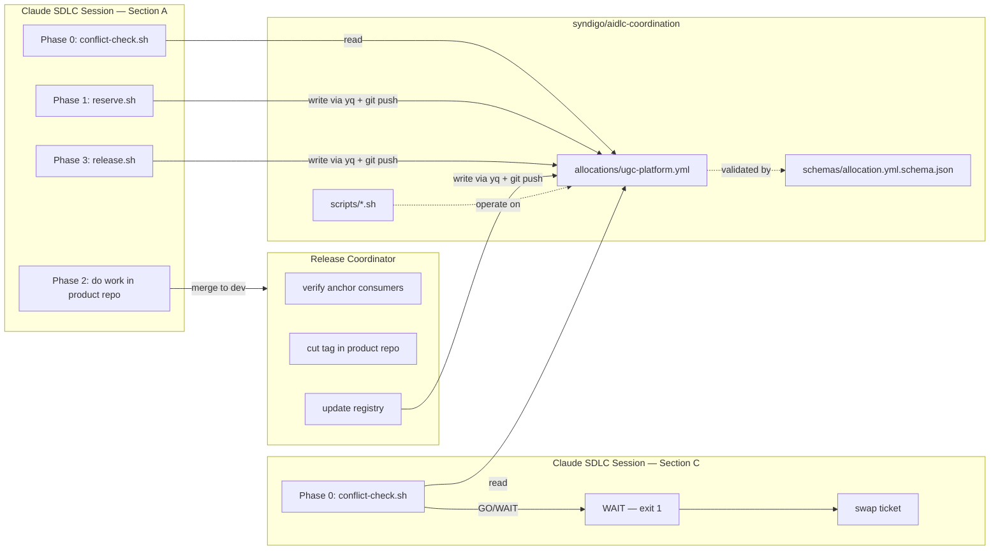
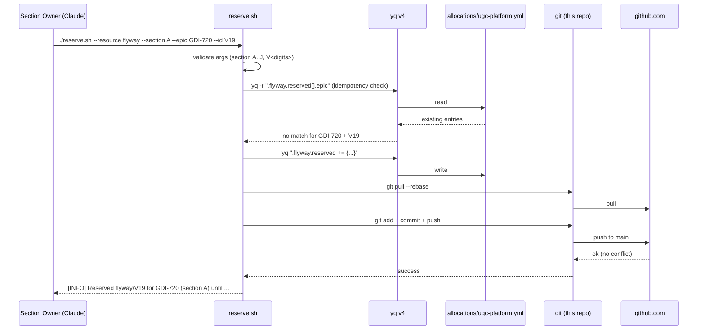
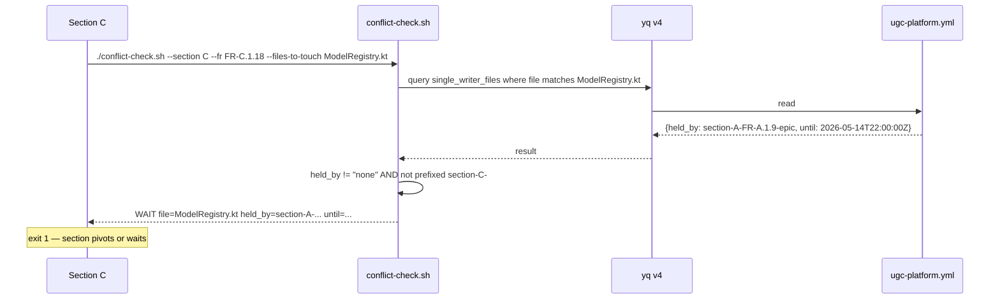
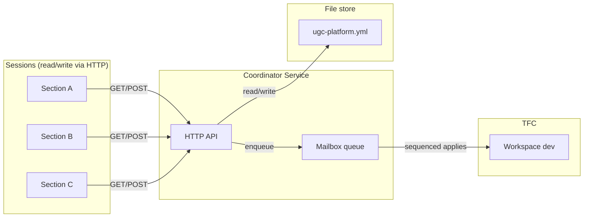

# How It Works

This document describes the architecture of the AIDLC Coordination Service.

---

## One-paragraph summary

A YAML file per product holds the **allocation registry** — what's shipped, what's
reserved, who holds what. Three POSIX-bash scripts read and write the YAML atomically
via local-clone + git-commit-as-audit-trail + push-with-rebase-retry. Sessions running
the SDLC pipeline call the scripts at the top of their work (to check) and at the end
(to release). Git is the audit trail; `yq` v4 is the YAML processor.

---

## System diagram



---

## Sequence: a happy-path reserve



If the push is rejected (someone else updated `main`), `reserve.sh` re-runs
`git pull --rebase` and retries — up to 3 times.

---

## Sequence: a conflict



---

## Why a file-based registry?

We considered three alternatives:

| Option | Pros | Cons | Decision |
|---|---|---|---|
| **File-based (chosen)** | No infra; git is the audit trail; trivial to validate; trivially recoverable | Sequential commits; ~5-second write latency | Day-1 winner |
| HTTP service (e.g. SQLite-backed Flask) | Faster reads; could enforce ACLs | Requires a deployable; bootstrap cost; another thing to monitor | Phase-2 if needed |
| Postgres + Hasura | Best query power; full RLS | Hugely overscoped for Day 1; we have 1 product | Rejected |

The file-based approach also lets us **see the entire state of the system by reading
one file** — invaluable during incidents.

---

## Atomicity guarantees

Each script's effective transaction is:

```
1. git pull --rebase           (fail → retry)
2. yq edit + write              (always succeeds locally)
3. git add + commit             (always succeeds locally)
4. git push                     (fail → goto 1, max 3 attempts)
```

This gives us **last-writer-wins** under contention. Lost-update is possible only if
two writers somehow bypass the rebase loop — which the scripts don't do. If you bypass
the scripts and write YAML by hand without rebasing, you can break it; the safeguard is
"only edit via scripts."

The `git pull --rebase` step is critical: it ensures we never lose another session's
write that landed between our last sync and our edit.

---

## Failure modes

| Failure | Detection | Recovery |
|---|---|---|
| `yq` not installed | `require_tools` fails fast | Install yq v4 |
| Push rejected (someone else updated) | Retry loop, max 3 attempts | Automatic |
| Schema violation (e.g. malformed timestamp) | CI catches; local scripts don't | Revert the offending commit |
| Stale reservation past TTL | Manual today; auto-sweep in Phase 2 | Re-reserve, or Coordinator clears |
| Operator edits YAML by hand without rebasing | Future writers' rebase usually fixes; rare lost-update possible | Restore from git history |

---

## Concurrency model

The registry is **single-master** (the `main` branch is the only place state lives).
Concurrent writers serialize via git's push contention; no other coordination is
needed. This is fine for the expected write rate (~5 reserve/release calls per section
per ticket × ~10 sections × ~10 tickets/week = ~500 writes/week; even bursts are
sub-second).

If write volume grows past ~10/second, move to the Phase-2 HTTP service backed by the
same YAML; sessions then read via HTTP, write via HTTP, and the service serializes
internally.

---

## What the YAML schema enforces

`schemas/allocation.yml.schema.json` (JSON Schema draft-07) enforces:

- All 6 top-level sections are present
- Enum values for `status` (no typos like `in-flight` vs `in_flight`)
- ISO-8601 timestamp pattern on `reserved_at`/`expires_at`/`shipped_at`
- Semver pattern on release tags (`vX.Y.Z`, `vX.Y.x`, or `pre-aidlc`)
- Flyway version pattern (`^V\d+$`)
- Section letter pattern (`^[A-J]$`)

What the schema does **NOT** enforce:

- **Cross-references**: the schema can't verify that
  `single_writer_files[].held_by` matches an existing
  `model_registry.pending[].epic` or `flyway.reserved[].epic`. That's a contract,
  enforced by humans + the scripts on the write path.
- **Logical consistency**: nothing stops someone from declaring `V19` both shipped and
  reserved in the same file. The scripts avoid this by construction.

The CI workflow runs the schema on every PR.

---

## Future architecture (Phase 2)



In Phase 2, the HTTP API becomes the authority for writes; the YAML in this repo is
the durable store; a mailbox queue serializes TFC applies so two sections' deploys
don't race.
